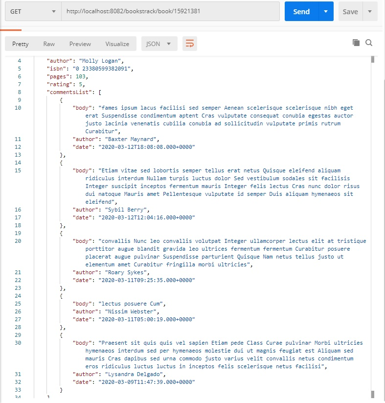

# books
Java backend API that keeps track of books read by a user. The application allows to:

##1.	Add a new book (
title,
 author, 
ISBN number, 
number of pages, 
1-5 rating of how much the reader enjoyed it; 
nice to have:  validate ISBN number)
#####POST  http://localhost:8082/bookstrack/book/save  
#####bad request:
``{"title":"Żółte Auto","author":"Piotr","isbn":"5356346356","pages":2,"rating":4,"commentsList":null}
#####good request:
 ``{"title":"Hibernate Search Skuteczne wyszukiwanie","author":"Steve Perkins","isbn":"978-83-246-8600-1","pages":127,"rating":4,"commentsList":null}

##2. List books entered into the system
parameters: 

page - number of following page

limit - number of records in one page

######GET http://localhost:8082/bookstrack/books/all?page=0&limit=5``
at 10000000 (10 milion) records page of 20 records is returned in aprx. 10 sek.
##3. Edit/remove the book entered to the system
take book for edition: 
#####GET http://localhost:8082/bookstrack/book/{id}
at 10000000 (10 milion) records the book is returned in aprx. 2 sek
save edited book:  
######POST http://localhost:8082/bookstrack/book/save
remove book
######POST http://localhost:8082/bookstrack/book/delete/{id}

##4. The API should respond in a timely fashion even when 10 million books are entered into the system. 
#### http://localhost:8082/bookstrack/search/?q={}&limit={}
the book is searched by parameter q, which may be author, title or isbn.
The result is sorted by title, author and isbn. 
The second parameter limit shows, how many records will be returned.
If the requeste value is greater then 10000 , only 1000 first records will be returned.
At 10000000 (10 milion) records the time of searching without limits depends on the frequency of searched text, it changes from few seconds to few minutes.
After setting the limit of number returned records the response time is aprx. 2 sec (max 10 sec)

##5. Add API to add a comment to a book.
 Every book can have multiple comments. The List books API from point 2. should include latests 5 comments for every book.
#### http://localhost:8082/bookstrack/comment/?bookId={id}}
{"body":" to jest ok...","author":"WL","date":null}

---------------------
##How to use:
database - MySQL
 DDL script DatabaseDDL.sql
 
application.properties
 
spring.datasource.url=jdbc:mysql://localhost:3306/bookstrack
####Test data
 books1m.csv books9m.csv comment1m.csv comment9m.csv
 ####Lucene index
 
 create direktory for Lucene index and put path to this directory to  application.properties
 
    spring.jpa.properties.hibernate.search.default.indexBase= {path}

####Preparing data

After creating database DatabaseDDL.sql and importing data from test data files

1. run application as SpringBoot main class    
    `wl.books.track.bookstrack.BookstrackApplication` 

2. run Postman and invoke request
   #####http://localhost:8082/bookstrack/build/index
    This create Lucene index, it takes some time, invoke it only ones after importing data.

3. Run requests 